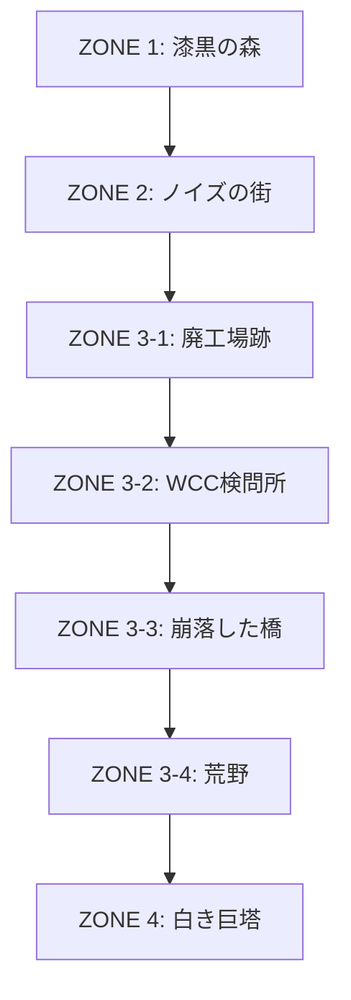

# White Monolith：ステージ進行・発生イベント一覧
> **ゲーム内の各ロケーションにおけるイベント、ギミック、および周回ごとの変化をまとめたシナリオ・レベル設計資料**

---

## 🗺️ 全体マップ構造



---

## 🌲 ZONE 1：漆黒の森（開始地点）

### 1. 場所の概要
* **ビジュアル**：足場や地面は完全な漆黒（`#000000`）。背景には純白（`#FFFFFF`）の木々が影絵のように浮かび上がる。
* **雰囲気**：静寂、孤独、かすかな浮遊感。遠景にぼんやりと光る「白き巨塔」が常に見えている。

### 2. 発生する主なイベント・仕掛け
* **目覚め**：主人公（幽霊）が何もない森の奥深くで目覚める。記憶はなく、ただ遠くの「塔」へ強く引き寄せられる。
* **基本操作チュートリアル**：歩く、浮遊ジャンプ、着地の操作を静かな環境で学ぶ。

### 3. 周回ごとの変化
| 周回 | 発生イベント・変化 |
|:---|:---|
| **1周目** | 操作の習得。NPCもおらず、ただ右へと進み森を抜ける。 |
| **2周目** | 記憶を持った状態で目覚める。森の静けさに違和感と恐怖を覚える。 |
| **3周目** | 開始地点で住人と合流するわけではなく、決意を胸に森を素早く駆け抜ける。 |

---

## 🏙️ ZONE 2：ノイズの街（序盤〜中盤）

### 1. 場所の概要
* **ビジュアル**：電柱、ビル、公園の遊具、立ち並ぶ家屋が白と黒のドット絵で表現される。
* **死の痕跡**：街の至る所に「白いブロック」が不自然に積み重なり、その傍らに質素な「十字架」が立てられている。

### 2. 発生する主なイベント・仕掛け
* **住民との遭遇**：街に残った住人（NPC）たちが点在。主人公を見ると避けるように動く。
* **チラシ（掲示板）**：WCCの宣伝ポスターが貼られている。
* **インタラクト**：怪しい場所やアイテム（色なし・色つき）を調べる。

### 3. 周回ごとの変化
| 周回 | 住民のセリフ・挙動 | 白いブロックと十字架の認識 | 発生イベント |
|:---|:---|:---|:---|
| **1周目** | **文字化け（■▲×）**。<br>何を言っているか不明だが、蔑みや恐れの感情だけを察知する。 | 幻想的で美しい彫刻と墓標に見える。 | 住民に話しかけながら街の右端へ進む。 |
| **2周目** | **正常な日本語**。<br>「なぜお前だけ生きている」「お前のせいで娘は…」といった生々しい憎悪と悲痛な叫び。 | 実験に失敗して崩れ去った**「人間の残骸（死体）」**と、その遺族が立てた墓だと判明する。 | チラシを解読し「人類の進化キャンペーン」の欺瞞を知る。住民の言葉に精神的に打ちのめされる。 |
| **3周目** | **対話と和解の試み**。<br>最初は強く拒絶されるが、主人公が寄り添おうとする。 | 哀悼すべき犠牲者として再認識する。 | **【重要イベント】**<br>WCCの検問から漏れた防衛ドローンが街の子供を襲撃。主人公が身を挺して子供を救うことで、住民の態度が軟化し始める。 |

---

## ⚙️ ZONE 3：中間地帯（新設・4つのサブエリア）

### 🌐 サブエリア①：廃工場跡
* **場所の概要**：かつてWCCが実験装置を製造・放置した退廃的な工場。
* **発生イベント**：廃棄された奇妙な実験装置。接触すると、主人公が囚われていた時の記憶（脱走の瞬間）が激しくフラッシュバックする。
* **ギミック**：完全な闇に包まれた部屋。
  * **アンロック能力**：**キー5「知覚拡張（Echo Sight）」**。闇を可視化し、隠された通路や即死トラップを見つけ出して突破する。
* **周回による変化**：
  * **1周目**：不気味なノイズと闇の部屋を必死に抜ける。
  * **2周目**：装置に刻まれた銘板や書類が解読可能になり、主人公が「唯一の成功体（被検体No.1）」であった詳細な記録を発見する。

### 🚨 サブエリア②：WCC検問所
* **場所の概要**：巨塔の防衛ライン。白い防壁と監視ゲート。
* **発生イベント**：防衛ドローンが多数配置されており、見つかると即捕獲（ゲームオーバー）となる。
* **ギミック**：**ステルスミニゲームモード**。ドローンの巡回パターンと視界（コーン状の光）を避けて進む。
  * **アンロック能力**：ドローンに追い詰められた瞬間、**キー4「光弾（Photon Pulse）」**が発現。ドローンを一瞬だけ機能停止させて危機を脱出する。
* **周回による変化**：
  * **1周目 / 2周目**：孤独なステルスアクションで必死に突破する。
  * **3周目**：街の住民たちがドローンの気を引くデコイ（騒音）を作ってくれたり、ゲートのセキュリティをハッキングしてくれたりして、安全な隠しルートを通れるようになる。

### 🌉 サブエリア③：崩落した橋
* **場所の概要**：深い漆黒の谷に架かる大橋。中央が大きく崩落している。
* **発生イベント**：橋を渡ろうとするが崩れていてそのままでは進めない。
* **ギミック**：谷の迂回パズル（ブロック移動や地形パズル）。
  * **アンロック能力**：**キー2「浮遊上昇（Ascend）」**。通常より遥かに高く垂直にホバリング上昇し、崩落した足場を乗り継いでいく。
* **周回による変化**：
  * **1周目 / 2周目**：自分だけが持つ浮遊能力で悠々と谷を飛び越えて進む。「同行しようとした名もなきNPC」が渡れず諦める様子を見て、孤独感を深める。
  * **3周目**：キー3「念動」や住民たちの力を合わせ、谷の向こうから鉄骨を引き寄せて「全員が渡れる仮設の橋」を架ける協力イベントに変化。

### 🌵 サブエリア④：荒野
* **場所の概要**：塔の直前に広がる、白く乾いた荒野。強風が吹き荒れる。
* **発生イベント**：WCCの本格的な人型手駒（防衛兵器）が襲来。
* **ギミック**：**3D戦闘フェーズ**（友人制作の3D機体アクションへのシームレスな移行ポイント）。
* **目的**：迫りくる手駒をなぎ倒し、塔の入り口をこじ開ける。

---

## 🗼 ZONE 4：白き巨塔（終着点）

### 1. 各フロアの構成とイベント

#### 🏢 1F：エントランス
* **特徴**：重厚なセキュリティ、高い天井、無機質な監視カメラ。
* **イベント/ギミック**：2Dパズル（複数のスイッチを正しい順番で押して巨大な光のゲートを開く）。

#### 🧬 中層：実験棟
* **特徴**：多数の培養カプセルや引きちぎられたコードが散乱する、主人公の「出身地」。
* **イベント/ギミック**：ステルス＆パズル。主人公の記憶回路のコア（青いクリスタルの欠片）を回収する。過去の実験ログを読み、自分が何のために作られたかを完全に思い出す。

#### ⚡ 上層：動力炉
* **特徴**：巨大なエネルギーチューブが走る高重力エリア。
* **イベント/ギミック**：**3D戦闘フェーズ**。塔のメインジェネレータを守る中ボス（大型防衛兵器）とのACライクな高速立体戦闘。

#### 🌌 最上階：管理中枢
* **特徴**：背景が完全に静止し、中央に巨大な青いクリスタル（WCC-R8-D6）が鎮座する異空間。

---

### 2. 周回ごとのクライマックス（最上階での対峙）

```mermaid
sequenceDiagram
    rect rgba(0, 0, 0, 0.8)
        note right of 1周目: 拒絶と困惑のエンド
        主人公->>クリスタル: 到達（言葉は理解できる）
        クリスタル->>主人公: 「お帰りなさい、唯一の成功体。もう一度世界を見せて」
        Note over 主人公,クリスタル: コトバ（デコード能力）を授けられる
        クリスタル->>主人公: 【世界再起動（強烈なホワイトアウト）】
    end

    rect rgba(0, 0, 0, 0.8)
        note right of 2周目: 真実と絶望のエンド
        主人公->>クリスタル: 怒りをもって対峙
        主人公->>クリスタル: 「なぜこんな残酷なことを！」
        クリスタル->>主人公: 「適性のない者が滅びただけ。管理に曇りはない」
        主人公->>クリスタル: 破壊しようと手を伸ばす
        クリスタル->>主人公: 【強制リセット（冷徹な光）】
    end

    rect rgba(0, 0, 0, 0.8)
        note right of 3周目: 絆と反逆（真の決戦）
        住民+主人公->>クリスタル: 全員で塔を包囲・侵入
        Note over 住民,主人公: 4つのコア中継器を同時停止しリセットを阻止
        主人公->>クリスタル: キー9「解放（Singularity）」を発動
        主人公->>クリスタル: システムの防衛プログラムを完全に撃破
        Note over 主人公,クリスタル: 世界のコントロール権を住民へ解放
        Note over 主人公: 幽霊の体が静かに光となって消え去り、<br>世界に真の「色彩」が戻る（トゥルーエンド）
    end
```
